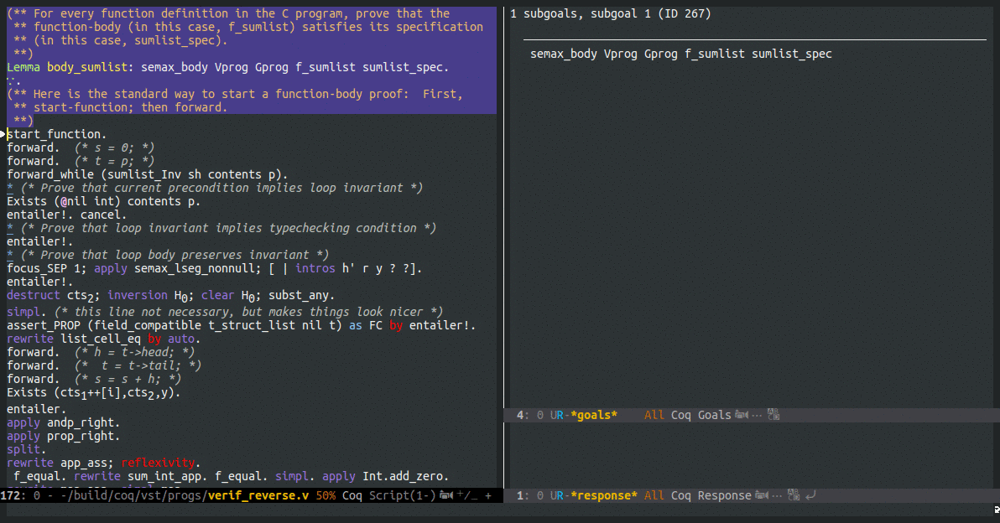

======================================================================
 PG-VST: Proof General extensions for the Verified Software Toolchain
======================================================================

What is it?
===========

How do I use it?
================

* Clone this repo::

    git clone https://github.com/cpitclaudel/pg-vst/ ~/.emacs.d/lisp/pg-vst/

* Register the package by adding the following to your ``.emacs``::

    (with-eval-after-load 'coq
      (load-file "~/.emacs.d/lisp/pg-vst/pg-vst.el")
      (add-hook #'coq-mode-hook #'pg-vst-mode))

* Enable PG-VST in a Coq session with ``M-x pg-vst-mode``.  You'll need to add the following to your file first, though (after ``Require Import floyd.proofauto.``)::

    (** <PG-VST> **)
    (* Undo abbreviations *)
    Ltac __pretty_print :=
      repeat match goal with
             | [ H := abbreviate : statement |- _ ] =>
               unfold abbreviate in H; unfold H; clear H
             end.
    (* Disable `::` list notation to facilitate parsing *)
    Notation nil := nil.
    Notation cons := cons.
    (* Make it easy to locate C programs *)
    Notation "'semx'  A B  '[[[__PROG__'  P  ']]]'  C" := (semax A B P C) (at level 50).
    (* Add a call to __pretty_print *)
    Ltac abbreviate_semax ::=
     match goal with
     | |- semax _ _ _ _ =>
            simplify_Delta;
            unfold_abbrev';
            match goal with |- semax ?D _ ?C ?P =>
    (*            abbreviate D : tycontext as Delta;*)
                abbreviate P : ret_assert as POSTCONDITION;
                match C with
                | Ssequence ?C1 ?C2 =>
                   (* use the next 3 lines instead of "abbreviate"
                      in case C1 contains an instance of C2 *)
                    let MC := fresh "MORE_COMMANDS" in
                    pose (MC := @abbreviate _ C2);
                    change C with (Ssequence C1 MC);
                    match C1 with
                    | Swhile _ ?C3 => abbreviate C3 as LOOP_BODY
                    | _ => idtac
                    end
                | Swhile _ ?C3 => abbreviate C3 as LOOP_BODY
                | _ => idtac
                end
            end
     | |- _ |-- _ => unfold_abbrev_ret
     | |- _ => idtac
     end;
     clear_abbrevs;
     (*build_Struct_env;*)
     simpl typeof;
     (* This is the only line that changed: *)
     try __pretty_print.
    (** </PG-VST> **)

  (Hopefully this snippet can be simplified if there's interest in using this code).

Try it on ``progs/verif-reverse.v`` in VST's source tree!

How does this work?
===================

A special notation is used to make C snippets easy to locate within the ``semax`` construct; with this notation in place, each time a new goal is displayed, PG-VST makes a pass on the goals, extracts each C snippet, pretty-prints the AST, syntax-highlights and indents the resulting C code with Emacs' C mode, and inserts the results in the goals buffer.

The pretty-printer only supports a subset of VST's C at the moment; it should be easy to extend it.
